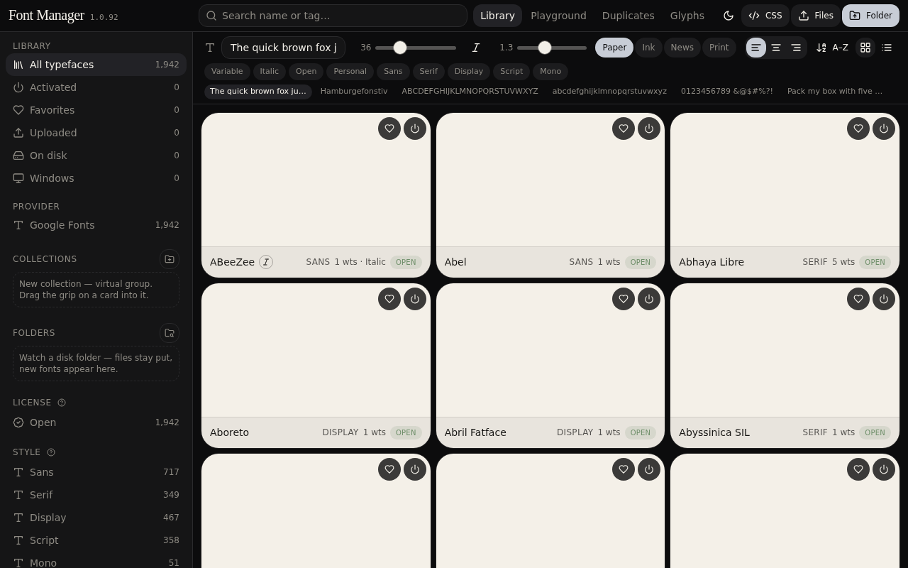
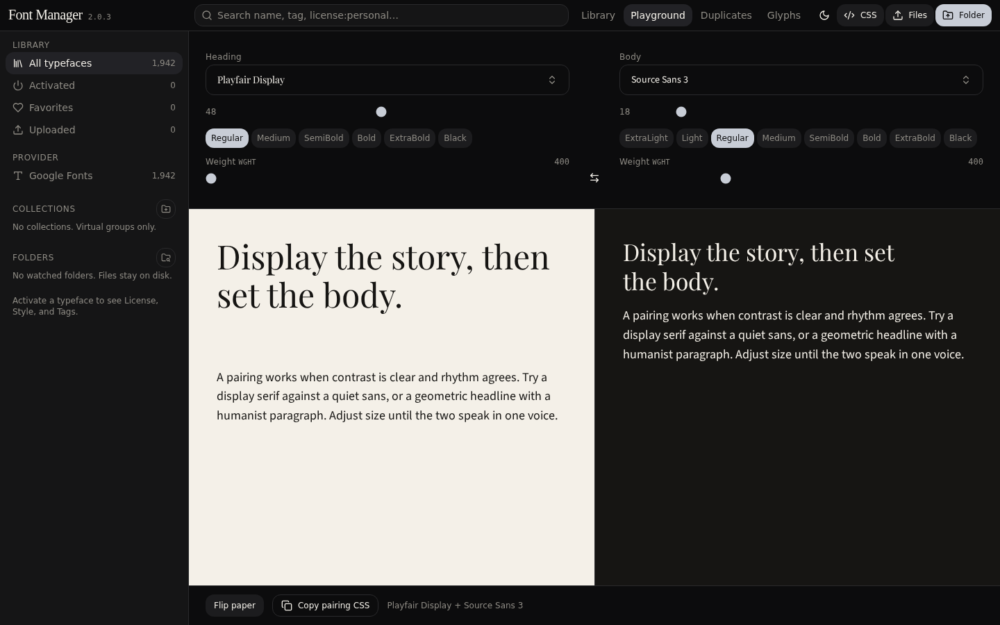
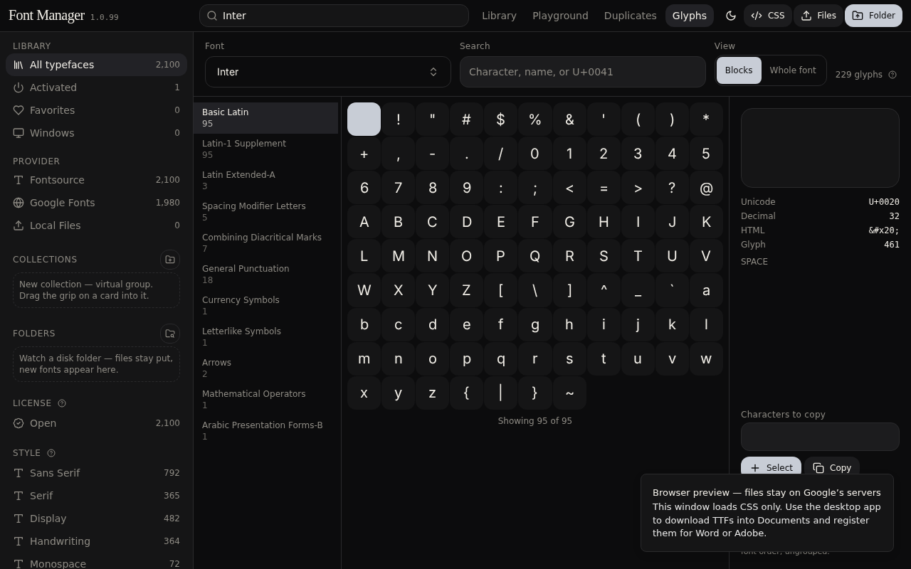
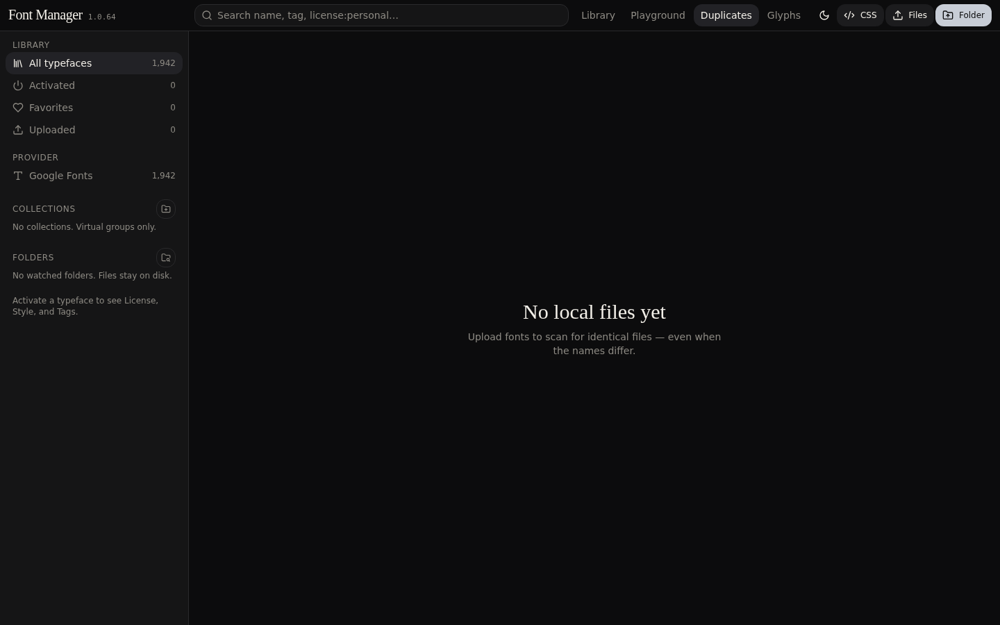
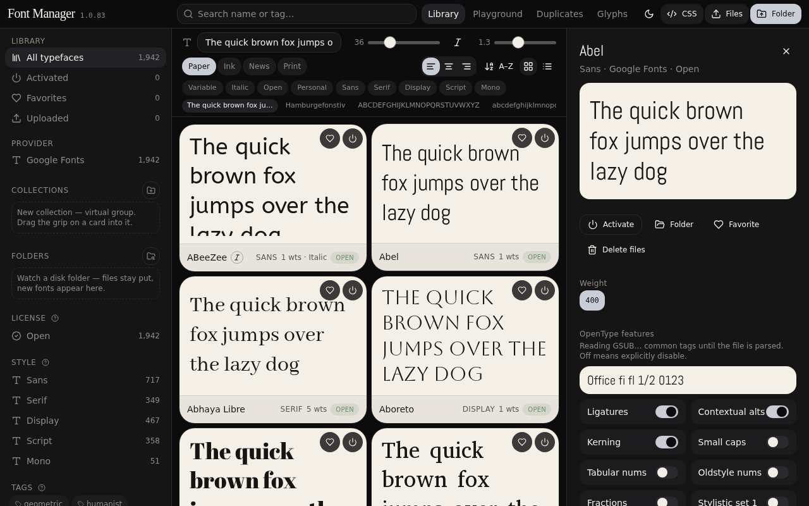

# Font Manager **1.0.92**

**TL;DR.** FontBase-style desktop typeface library. Browse ~1,968 Google Font families, upload TTF/OTF/WOFF/WOFF2/TTC, **Activate** so Word, Adobe, and Figma can use them while this window is open. Files live in `Documents / Font Manager`. This website is the same UI — a dress rehearsal before `deploy.bat`.

Version **1.0.92** sits next to the logo, not in the window title.

**1.0.92** — **Windows** drawer lists `C:\\Windows\\Fonts` (Arial, Calibri, Segoe) as read-only. COLRv1 / emoji specimens use `font-palette` and a color TTF when Google only serves WOFF2. Watched folders re-scan every 2.5s and pick up replaced files. Activate is still sequential and off the UI thread.

**1.0.91** — sequential Google activate, On disk in Library. **1.0.90** — scan before download. **1.0.86** — Fontsource TTF for WOFF2-only families.

**1.0.90** — Scan before download flag. **1.0.89** — session restore + slider persist. **1.0.88** — card/inspector axes share a store. **1.0.86** — Fontsource TTF for WOFF2-only families. **1.0.85** — Deactivate keeps files.

**1.0.88** — Library card weight slider and inspector axes share one store. Drag either; both update. Google CSS preview is never `&text=`-subsetted. Activated files on disk stay the install cache (Word/Adobe); the grid still paints through CSS so this website and the desktop window match.

**1.0.87** — Windows build compiles (borrow checker). **1.0.86** — WOFF2-only families install via Fontsource TTF. **1.0.85** — Deactivate keeps files; Activate again does not re-download.

**1.0.85** — Deactivate keeps files. Activate again only registers them. Download runs only when the family is missing or the files are broken (WOFF2/truncated).

**1.0.84** — Activate installs every Windows-installable style (weights + italic). WOFF2 is skipped. Three workers.

**1.0.83** — Playground themed scrollbar. **1.0.82** — Library CSS preview matches desktop. **1.0.81** — launch does not download. **X closes the app**; on-disk activations come back next launch.

---

## Features

| Area | What it does |
| --- | --- |
| Library | Search, sort, grid/list, search chips. Cards virtual-scroll (~280px columns). No “Show more” button. |
| Activate | Session fonts via `AddFontResourceW`. Other apps see them until you Deactivate. Close quits. Next launch re-registers **files already in Documents** — it does not download. |
| Google Fonts | Catalog is metadata only. Activate scans Documents first: intact TTF/OTF/TTC are registered, **not fetched**. Download only if missing or broken (WOFF2/truncated). First fetch writes every listed weight + italic. Three workers. |
| Uploads | Drop files or a folder (TTF, OTF, WOFF, WOFF2, TTC). Parsed on a worker so the grid stays live. Stay in Documents. Deactivate unloads; Delete removes files. |

| Inspector | In-flow right column (not a dimmed overlay). Weight, italic, variable axes, OpenType toggles, license. |
| OpenType | GSUB/GPOS tags from the TTF. Toggles drive `font-variant-*` + `font-feature-settings`. Demo line: `Office fi fl 1/2 0123`. |
| Playground | Compare activated faces. |
| Duplicates | Same size → binary diff. Different names + sizes stay separate. |
| Glyphs | Character map. Search as you type. Tofu stays (hover **?**). Atlas is cached — first open of a face is the slow parse; switching tabs does not reload. |
| Collections / Folders | Virtual groups vs watched folders on disk. |
| License / Style / Tags | Catalog metadata — no Activate required. Google uses official class. Uploads use filename first; junk PANOSE from free-font sites is ignored (`?` tooltips). |

---

## Screenshots

| | |
| --- | --- |
| Library |  |
| Playground |  |
| Glyphs |  |
| Duplicates |  |
| Inspector |  |

---

## Activate vs Deactivate vs Delete

| | Disk | Other apps |
| --- | --- | --- |
| **Activate** | Download if missing; keep the TTF | Register for this session |
| **Deactivate** | File stays | Unload |
| **Delete** | Remove the family folder | Unload |

**X** closes the app. Families already saved in Documents are registered again. Google files are **not** downloaded until you Activate.

---

## Install (Windows, VS Code only)

1. [Node.js 22 LTS](https://nodejs.org) (Node 24 also builds).
2. Unzip the project → VS Code **File → Open Folder**.
3. Double-click **`deploy.bat`**. Leave it open through **three** phases:
   1. **Pack the UI** — Vite writes `desktop-….js`. A banner says **Phase 1 done**. That is **not** the installer.
   2. **Compile Rust** — cargo `--release` with LTO (first time 5–15 minutes). Looks like a new process; do not close the window.
   3. **Write installers** — MSI (if WiX v3 is installed) and NSIS setup. Explorer opens `src-tauri\target\release\bundle\`.
4. Install from `bundle\nsis\` (or `bundle\msi\` if WiX built one). Other PCs do not need Node or Rust.
5. If an older setup is still on the PC: double-click **`fix-install.bat`** (clears leftover AppData + registry, then launches the new setup). Fonts in `Documents / Font Manager` stay.

**`desktop-setup.bat`** only **runs** the app (dev window). It does **not** make installers.

NSIS always builds. MSI needs [WiX Toolset v3](https://wixtoolset.org); without it you still get the NSIS setup. If WiX is installed but not on PATH, setup now adds its `bin` folder automatically. No Visual Studio IDE. WebView2 is embedded if missing.

**X** closes the app. On-disk activations come back on the next launch. Google downloads only happen when you click Activate.

### What the yellow compile log meant

| Line | Meaning |
| --- | --- |
| `INEFFECTIVE_DYNAMIC_IMPORT` | Harmless cycle-breaking `import()`. Filtered as of **1.0.81**. |
| `PLUGIN_TIMINGS` | Vite timing info. Filtered. |
| `[tauri-index] wrote …\index.html` | UI pack finished. Quiet now. **Rust had not started yet.** |
| `DATABASE_URL not set` | Website migrate skip. Desktop never runs it. |
| Tab title `db:migrate` | Nested npm script. Desktop uses a dedicated hook so the tab stays on `tauri build`. |

Closing the window after `index.html` aborts cargo. Wait for Explorer to open `bundle\`.

---

## How this was prompted (vibe coding)

You never opened an IDE first. You talked to **Grok Build**, watched the live preview, sent screenshots, and said what was wrong.

**Opening line (paraphrase).** *Clone FontBase: a Documents folder of real fonts, activate so other programs see them, Google auto-download, uploads.*

**How to prompt this kind of app**

1. Name the clone and the **one folder** on disk (`Documents / Font Manager`).
2. Spell rules as tables (Activate vs Deactivate vs Delete).
3. When a control is slow or lies, say **which screen** and **desktop vs website**.
4. Send a screenshot. Ask **not** to touch unrelated code.
5. When the Grok preview looks right, run `deploy.bat`. Desktop-only bugs (GDI, tray, downloads) only show after that.

**Preparations:** Grok App Builder (Vite, React, Playwright, Tauri 2), Node.js **22+**, Rust stable, Google Fonts metadata + Fontsource CDN. No foundry files in the installer. Then **VS Code** + `deploy.bat`.

---

## Stack (what actually runs)

- **UI:** Vite, React, Zustand persist (favorites, activated, collections, tags, uploads, preview, slider axes, scope — not the download queue).
- **Desktop:** Tauri 2, Rust `reqwest` downloads, `AddFontResourceW` + `SendNotifyMessageW(WM_FONTCHANGE)`.
- **Parse:** Fast table reader for TTF/OTF/WOFF1/TTC (name, OS/2, fvar, GSUB tags). `opentype.js` is the fallback. Desktop also has Rust `ttf-parser` for cmap / axes on files in Documents. WOFF2 previews in the browser; Windows install still wants TTF/OTF.
- **Preview:** Chromium `FontFace` + Google CSS2 (same on this website and in the desktop WebView). Word/Adobe use DirectWrite/GDI after Activate.

Not wired in on purpose: **skrifa**, **DirectWrite in the WebView**, auto-update of the installer.

---

## Activation after close

Activate is a **session** register (`AddFontResourceW`). Files stay in `Documents / Font Manager`. Closing the window **quits** the app (fonts unload with the process).

Next launch:

1. One walk of Documents. Intact last-session files are registered so Word/Adobe see them again.
2. The UI marks those families Activate. Missing names are **not** queued.
3. Nothing is downloaded until you click Activate. If the family is already in Documents and intact, it is only registered.

Deactivate unloads and **keeps files**. Activate again does **not** download. Delete removes the folder.

---

## Google download

1. Click Activate. The UI returns immediately. A background thread scans `Documents / Font Manager`.
2. Intact TTF/OTF/TTC → register, skip fetch. The family turns on as soon as the scan hits it.
3. Missing or broken (empty, truncated, WOFF2) → download **one family at a time**. Google CSS first; if it only has WOFF2, Fontsource TTF for that script (khmer, lao, lycian, …).
4. Windows is notified in batches so Word/Adobe do not stall. Retry replaces files. Pause / Stop still work.

Deactivate unloads and **keeps files**. Activate again is register-only. Preview stays CSS in this window.

**On disk** (Library) is that Documents cache — Google families you already downloaded. It is **not** `C:\Windows\Fonts`. You can view them, deactivate them, or Delete files in the inspector. Arial and Calibri are not listed.

---

## Next version (not in 1.0.92)

- Signed installer + auto-update (SmartScreen / Store) — needs a code-signing cert; not a code change we can fake.
- Native WOFF2 → TTF in Rust — new crate / MSRV; Fontsource TTF already covers install.
- Search chips (`license:personal` without typing) — license rows already filter; chips are sugar.
- Extra TTC faces as separate cards — TTC already registers every face with Windows; splitting preview cards is optional.
- Other providers (Fontshare, Bunny) behind the same scan-then-download rules.

---

## Variable weight slider

Hover a variable card to pop a weight slider. That value lives in one Zustand map (`previewAxes`) shared with the inspector, so the selected card and the inspector scrub together. Other axes (width, italic, …) written in the inspector also apply on the card specimen. Preview CSS has no `&text=` subset. Activated TTFs in Documents are the install cache for Word/Adobe — not a second preview pipeline.

---

## Website vs desktop library

| | This website | Desktop window |
| --- | --- | --- |
| Library cards | Google CSS2 + FontFace | **Same CSS2 + FontFace** |
| Activate | Preview only (no GDI) | `AddFontResourceW` so Word/Adobe see the TTF |
| Documents folder | Not used | Scan first; skip intact; download missing on Activate |

Do not expect a second “desktop-only” preview. If a family is already in Documents, Activate still registers that file; the card still paints through CSS so it matches Grok.

---

## Pseudo-subsetting — yes, for this website only

Google Fonts CSS `text=` (a latin alphabet subset) is **recommended here** so ~2,000 cards do not download full glyph sets. It is **not** used for desktop TTF installs. Word and Adobe need the real file.

| | Website preview | Desktop Activate |
| --- | --- | --- |
| Technique | CSS `&text=` alphabet | Full TTF from Fontsource / Google |
| Why | Faster first paint | Other apps cannot use a 52-letter subset |

---

## Store-ready (Windows)

The MSI + NSIS installers are what you ship today: no telemetry, local files only, publisher/copyright/license on the bundle, activations survive Quit. NSIS installs for the **current user** (no admin). WebView2 bootstrapper is embedded.

Microsoft Store still needs an **MSIX**, a paid publisher identity, and code signing. Those are not produced here. Sideload the MSI or NSIS setup for personal use.

---

## GitHub

The connected GitHub account (`eect13`) cannot create repositories from this chat (the connector is missing `repo` create). Create **`eect13/font-manager`** (private is fine) in the GitHub UI, then reconnect GitHub with repository write access and ask to push. `.gitignore` excludes `node_modules`, `src-tauri/target`, installers, and `.vercel`.

---

## Library windowing

A sentinel with an 800px margin used to append cards until **all ~1,942** were in the DOM.

Now: the grid **virtual-scrolls**. Only the rows in view (plus a small overscan) are in the DOM, so all ~1,968 families stay scrollable without a “Show more” button.

Library / Playground / Duplicates / Glyphs stay **mounted** after the first visit (`visibility` hide, not `display: none`) so search, scroll, and the glyphs atlas survive like browser tabs. Visited tabs are remembered in `sessionStorage` for this window.

**Glyphs:** tofu boxes stay — they are cmap slots with no drawable outline, and they count. Hover the **?** next to the glyph count. First parse of a face is the slow part; the atlas is cached and tab switches do not re-parse.

---

## OpenType features

Toggles looked dead because “The quick brown fox” has no `fi` / `1/2`, and Google faces were not parsed for GSUB.

Opening the inspector reads GSUB/GPOS from the TTF. Switches set `font-variant-ligatures` / `caps` / `numeric` plus `font-feature-settings`. Watch **`Office fi fl 1/2 0123`**. Coding faces (Anonymous Pro) often have no `liga` — after parse, only real tags stay.

---

## Troubleshooting

| Symptom | What to do |
| --- | --- |
| First Activate is slow | That family is downloading. Next launch registers the file on disk — no fetch. |
| `tauri.conf.json` parse error | Version must be `"1.0.92",` — **one** comma. |
| Word doesn’t list the face yet | Wait a second; open the font menu again. |
| OT toggles do nothing | Use the demo line, not the pangram. Confirm the file actually has that tag. |
| Display face clipped | Library cards shrink-to-fit (min 13px). Inspector alphabet wraps with `overflow-wrap: anywhere`. |
| Can’t install — **Unable to uninstall** / **Error launching installer** | Double-click **`fix-install.bat`**. Rebuild with **1.0.92** (`deploy.bat`). Right-click setup → Properties → **Unblock** if Windows marked the file. |
| Build window closed after `index.html` | That was only the UI pack. Re-run `deploy.bat` and wait for Explorer. |
| MSI missing, only setup.exe | Install [WiX Toolset v3](https://wixtoolset.org), then `deploy.bat` again. NSIS is enough to install. |

**1.0.81 — ready for personal desktop use.** License / style / tags stay inferred. Not legal advice.
