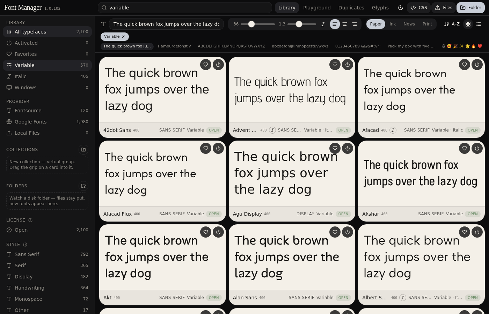
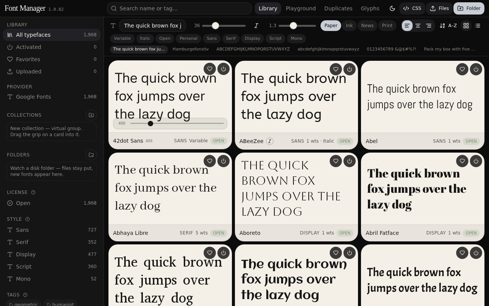

# Font Manager **1.0.172**

FontBase-style desktop typeface library for Windows. Browse **Google Fonts** and **Fontsource**, upload TTF/OTF/WOFF/WOFF2/TTC, then **Activate** so Word, Adobe, and Figma see them while this window is open.

**100% temporary session activation.** Zero registry bloat. Fonts unload on close. Library files live in `Documents / Font Manager` — nothing is copied to `C:\Windows\Fonts`. GDI registers **copies** under `%LOCALAPPDATA%\Font Manager\gdi-maps`, so Documents family folders are not write-locked after Quit (Repair / Explorer delete can proceed).

The in-browser preview is a CSS catalog only (no Word/GDI). The Windows app is the product.

**1.0.172.** Clear Sans planned/expected = Intel’s **8** TTFs (not Fontsource 10). Heal rewrites sticky `.expected=10` → 8; 8/8 Intel faces + Add → complete. Skip-Add HOLD unchanged.

**1.0.171.** Clear Sans Activate uses Intel Clear Sans TTFs only (Fontsource CDN WOFF/odd ~67KB refused by GDI). Gidugu official TTF documented as known GDI-incapable for session install (honest refuse toast; no Retry churn). Sticky CJK “Couldn’t load” fixed: hydrate `loaded()` from size-matched gdi-maps before ready-register; session-active + maps = skip-live, not `failed_names`. Add=0 never stamps `.complete`. No pack/NSIS this tip.

**1.0.170.** Merge main hydrate honesty + tip catalog currency. VF ensure covers google-catalog variable **and** all Fontsource-other `variable:true` with google/fonts TTFs (Material Symbols WOFF2-only excluded). Per-family download order: variable TTFs first, then Google statics, then Fontsource remaining when Google listed no statics. Refresh catalogs also checks GitHub latest release vs installed. Safe session-live register skip (size-matched gdi-maps). Variable badge/sort still on-disk only. No library wipe.

**1.0.169.** Boot Activated badge = GDI-registered families only (`result.ready` ∪ session_begin sidecar) — files in Documents and local uploads from last persist are not live if Add failed. Skip on failed downloads never wipes every pending queue when names match no catalog ids. Fontsource-only families that still ship a public google/fonts VF (42dot Sans, Big Shoulders*, Briem Hand, Finlandica) are ensured/backfilled as `*-variable-*` TTFs so the Variable badge can turn on after Activate; Material Symbols* still skipped (no TTF VF). Repair-all complete folders also ensure those FS-only VFs. No size-matched skip of copy+Add (PR #22 register-skip not taken). No pack/NSIS this tip.

**1.0.168.** Variable/status honesty: Variable badge + facet count = intact on-disk `*-variable-*` only (never `catalog.variable` / live Fontsource alone — 42dot Sans statics stay non-Variable; no synthesized wght axes without a VF file). Clear Sans–style toasts split files-on-disk / `.complete` yes|no / GDI cause (stage-copy vs Add≤0 vs unloading) and never claim `.complete` without the marker; ready-path GDI 0 clears sticky `.complete`. Retry re-stages+Adds (no library wipe; not ambient skip-intact-only). Catalog-variable folders with `.complete` but missing VF show Incomplete/Repair (`.complete` ≠ vars done; ensure still pulls VFs). Gidugu undersized remnants (allowlist + tight 24–80KB band; not all Google 16–96KB) clear sticky `.complete`, Repair/Activate re-fetches **that face only** (compare-to-upstream on write; toast: undersized vs Google / latin subset remnant). Refresh catalogs preserves on-disk VF `variable:true` without axes; Scan Disk applies `applyDiskStatusHonesty`. Packed NSIS to `Desktop\Vibe Apps\Font Manager\Installers`. Variable sort/facet matches on-disk `*-variable-*` only (same rule as the badge).

**1.0.167.** Session restore: `.session-maps.json` validates/rebuilds **before** stale recover (missing stage ≠ unlock→nuke maps/active); re-stages missing (copy-only); `.session-paths.txt` stores stage paths only (Documents refused for GDI); stale maps clear on successful quit unload. VF backfill need-filter includes dual-VF roman-only (Hei/Sung italic). Repair replaces tiny latin-subset CJK statics (~35–60KB) from full Google TTFs without wiping folders. No pack/NSIS this tip.

**1.0.166.** Catalog-variable CJK VFs over ~20MB (Chiron GoRound/Hei/Sung, Noto Serif KR·SC) no longer fall through empty on jsDelivr — `download_google_variable_ttfs` tries GitHub raw, `MAX_TTF_FETCH_BYTES` is 64MB, METADATA.pb has the same CDN fallback, and dual-VF Hei/Sung retry italic when only roman is planned/intact. Ensure fail-louds when a non-denylist family returns 0 vars. On-disk Activate finishes VF backfill before `running=false` (Repair remains the sync smoke path for complete folders). `.complete` stays for missing VFs; statics untouched; exact-7 no-public-VF denylist unchanged.

**1.0.165.** Activate All on-disk register no longer freezes the window (GDI register runs on a worker with ≤6 parallel `register_intact_family`; invoke returns immediately; progress % + ready_names via poll/event). Cancel/Pause abort or hold that register queue (not only downloads). Pending-until-GDI honesty unchanged. Scroll/sidebar/preview polish when present. Default deploy folder: Desktop\Vibe Apps\Font Manager\Installers.

**1.0.164.** Folders sidebar counts follow auto-hide duplicates the same way Collections do (Local Files stays full). Activate All no longer treats on-disk / `.complete` / queued as activated — progress and the Activated badge wait for real GDI register (locals queue as pending like Google until mark-live). Plan/resume invoke fail returns no live marks; on-disk register emits live %; partial GDI fail clears pending and bumps failed. Mixed Activate All on-disk google finish scopes `clearPending` to google family names (does not wipe local install-queue pending).

**1.0.163.** Activate/Deactivate show a live percent + ETA that ticks while work runs (on-disk register no longer jumps to 100% while GDI is still adding; Deactivate no longer toasts “done” on click or on a leftover idle poll). Collection counts follow auto-hide duplicates; Provider → Local Files still shows the full upload total.

**1.0.162.** Live percent bar + ETA. Pause holds the same percent; Resume continues the queue and does not restart from 0%.

**1.0.161.** Catalog Delete no longer re-Activates after Recycle Bin (the inspector used to toggle power on again, so files came back and the toast looked false). Error toasts now show the real Rust message.

**1.0.160.** Delete in the inspector sends the family folder to the **Recycle Bin** (unload GDI first). Restore from there if you change your mind. Temp download files and GDI session copies are still wiped.

**1.0.159.** Closing no longer freezes a hidden process for minutes (event loop was blocked on unload → second launch hung → two processes, no window). Quit hides immediately, Removes in the background, and always exits within 4 seconds; leftovers are cleared on next boot. Italic preview no longer fakes a slant on roman-only families. Delete lives in the inspector (with confirm), not between Favorite and Activate.

**1.0.158.** Quit no longer restarts Font Cache or retries write-locks on the hidden process (that left a Task Manager zombie; a second launch pinged it and the UI never appeared). Single-instance while quitting exits so the next click starts clean; next boot still `Remove`s leftovers. Open Sauce Sans **10/14** was jsDelivr returning HTTP 200 with a non-TTF body for 4 faces — not a missing npm package. Activate now skips those (no circuit trip) and fetches the official GitHub TTFs (`marcologous/Open-Sauce-Fonts`).

**1.0.157.** In-place `AddFontResourceExW` on Documents TTFs was the lock: Windows Font Cache kept those handles after exit, so Open Sauce Sans could not finish writing faces and Explorer could not delete family folders. Activate now maps LocalAppData copies (Documents originals stay). Quit still `Remove`s both the copy and any leftover 1.0.156 Documents path. **Once:** if folders are already locked from 1.0.156, reboot once after installing 1.0.157, then Repair Open Sauce Sans.

**1.0.156.** Open Sauce Sans (and other Fontsource `type: other`) pins jsDelivr with the **npm** tag (`5.3.0`), not foundry `v1.477` which 400s — Activate can stamp `.complete`. Catalog-variable families: **551/558** have a real TTF in google/fonts (bracket or `VariableFont_*`). Session restore **registers first** (no CDN on the boot path); missing variable files backfill in the background. Ready-checks run in parallel. Disk scan and System drawer wait until after first paint.

**1.0.155 unlock.** After Deactivate/Quit, `RemoveFontResourceExW` drains refcounts (loop until 0), then best-effort **Windows Font Cache** service restart so Documents TTFs stop sticking under `svchost`/LOCAL SERVICE. Soft-fail AccessDenied may still need admin once; unlock is proven only after WRITE_OK on a real Windows box. Startup registers ready session families in **parallel** (bounded workers; GDI Add/Remove serialized process-wide); Activate stays Adobe-visible enumerable (`FR_ENUMERABLE`).

---

## Screenshots

| Library (desktop) | System fonts on this PC |
| --- | --- |
|  |  |

| Variable facet (on-disk VF only) | Weight / axes |
| --- | --- |
|  |  |

Captures are from the **installed desktop app** so specimens actually paint (OS faces + catalog CSS). The website preview cannot register fonts for Word. **Variable** in sort/facet/badge means an intact `*-variable-*` file is on disk — catalog flags alone never put a family in Variable.

---

## Features

| Area | What it does |
| --- | --- |
| **Library** | Search, sort, grid/list. ~2,100 faces. Virtual-scrolled cards with live specimens. |
| **Activate** | Session fonts via `AddFontResourceExW`. Other apps see them until you Deactivate or quit. Library stays navigable (sidebar, tabs, search, cards) while Activate/download runs — progress stays in the non-blocking bar. |
| **Google Fonts** | Official list (~1,946). Overflow: Activate remaining / Deactivate all / Scan disk (Repair **or** Remove extras — not both). |
| **Fontsource** | Exclusive `type: other` families (~150). Same overflow menu. |
| **Uploads** | Drop files or a folder. Stay in Documents. Deactivate unloads; Delete removes files. |
| **System** | View-only snapshot of fonts already on the PC. Never uninstalls OS faces. |
| **Inspector** | Weight, italic, variable axes, OpenType toggles, license. |
| **Playground** | Compare activated faces side by side. |
| **Glyphs** | Character map by Unicode block. Search by char, hex, or name. |
| **Duplicates** | Same-size binary diff; auto-hide extras. |

---

## Activate vs Deactivate vs Delete

| | Disk | Other apps |
| --- | --- | --- |
| **Activate** | Download if missing (Google CSS richest listing first, streamed to disk); keep the TTF | Register for this session |
| **Deactivate** | File stays | Unload |
| **Delete** | Remove the family folder | Unload |
| **Repair** | Re-fetch when `.complete` is missing or face count is short of expected | Register when done |

**X** quits the app (session fonts unload via `RemoveFontResourceExW` on the LocalAppData GDI copies **and** any leftover Documents paths; `.session-paths.txt` / `.session-active.json` clear when Documents write-locks are gone). Library TTFs stay in Documents. A family is **ready** only with a `.complete` marker stamped when the on-disk face count matches the expected full set — partial downloads do not stamp, and Scan/hydrate deletes lying `.complete` markers (including legacy bare `"1"` with no expected face count, and official Google Fontsource latin packs stamped complete without `.google-planned`, or — when there is no planned key list — below the catalog weights×italic floor; when `.google-planned` is a real key list, expected = keys.len() only) so Repair appears. Next launch recovers any stale session sidecars, then UI hydrate re-Activates the persisted library selection — no re-download.

**1.0.149 UI honesty.** Activated scope and badge always follow live `activated[]` (never merge download queue / pendingActivate; no freeze while downloads run). Google Fonts drawer count is the official directory size (~1,946), not the full Fontsource-merged list. Catalog refresh toast: `Catalog N (Google 1946 · Fontsource exclusive M)`.

**Google install path.** For catalog-**variable** families, Activate pulls **both** Google CSS instance TTFs (Mozilla/Googlebot; name-patched for Adobe menus) **and** real variable TTFs from `google/fonts` via jsDelivr then GitHub raw (`Nunito[wght].ttf` → `nunito-variable-wght.ttf`; CJK VFs >~20MB need raw). Planned = statics + vars (never var-only). Vars are listed/registered first so Illustrator/AI can pick axes; statics stay as backup. Already-`.complete` folders missing `*-variable-*` still fetch vars on Activate/Repair without a full bust. When axis-range CSS only yields range-weight keys (`font-weight: 200 1000` → `200-1000`), planned instance keys prefer the discrete static `ital,wght@0|1,w` listing instead. Google CSS instances **and** real `*-variable-*` TTFs are name-patched so Illustrator sees family `Nunito` (not `Nunito ExtraLight`): statics get style `ExtraLight`/`Bold`/…; vars get `Regular`/`Italic` while keeping `fvar`. Never Chrome/Safari WOFF2 and never `@fontsource-variable` WOFF. `.complete` / `.google-planned` count instances **plus** variable files. Latin remnants are not purged into an empty folder when a Google fetch writes nothing. Fontsource fills only when Google listed **0** faces.

**Documents sync.** `Documents / Font Manager` (plus `Activated` / `Library` children) stays in sync with the library via Scan, hydrate, and an app-owned live folder watcher while the window is open. Users still cannot add it (or Windows Fonts) as a watch folder. WOFF/WOFF2 on disk are preview-only — not counted as corrupt.

---

## Install (Windows)

1. [Node.js 22 LTS](https://nodejs.org) (Node 24 also builds).
2. Clone or unzip → open the **inner** project folder in VS Code (not an empty wrapper). A name like `font-manager-main (1)` is fine.
3. Double-click **`deploy.bat`** and leave it open through all three phases: pack UI → compile Rust (first time 5–15 min) → write installers.
4. Installers land under **`Desktop\Vibe Apps\Font Manager\Installers\`** (created if missing; override with `node scripts/deploy.mjs --out <path>`). Bundle also stays under `src-tauri\target\release\bundle\`.
5. If an older setup fights the new one: run **`fix-install.bat`**.

**`desktop-setup.bat`** only runs the app in a dev window — it does **not** make installers.

NSIS always builds. MSI needs [WiX Toolset v3](https://wixtoolset.org). WebView2 is embedded if missing.

---

## Website vs desktop

| | This website | Desktop window |
| --- | --- | --- |
| Library cards | Google CSS2 / Fontsource CSS | **Same** preview pipeline |
| Activate | Preview only (no GDI) | Registers so Word/Adobe see the TTF |
| System drawer | Empty | Lists fonts already on the PC |

---

## Stack

- **UI:** Vite, React, Zustand
- **Desktop:** Tauri 2 + Rust (`AddFontResourceExW` / `RemoveFontResourceExW`, session paths under Documents)
- **Preview:** Chromium `FontFace` + Google CSS2 / Fontsource CSS

---

## Troubleshooting

| Symptom | Fix |
| --- | --- |
| First Activate is slow | That family is downloading. Next launch only registers the on-disk file. |
| Word doesn’t list the face yet | Wait a second; reopen the font menu. |
| Setup skips install/uninstall radios | Use the **1.0.133** setup. Radios appear when an old copy is installed. |
| Unable to uninstall / Error launching installer | Run **`fix-install.bat`**. Right-click setup → Properties → **Unblock** if needed. |
| Build window closed after `index.html` | That was only the UI pack. Re-run `deploy.bat` and wait for Explorer. |
| App opens a second window / runs twice | Only one instance is allowed. Launching again focuses the already-open window. |

---

## License

See [LICENSE](LICENSE).
