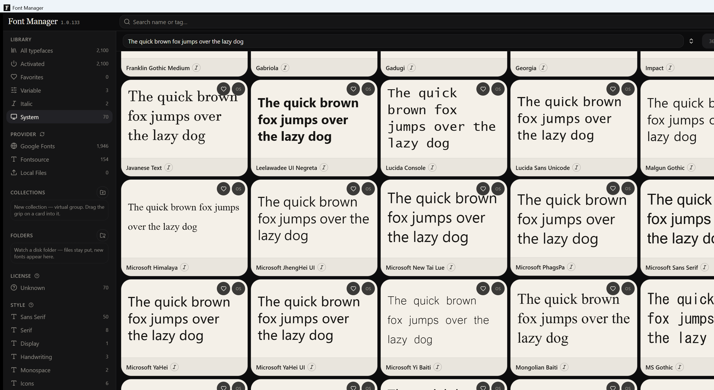
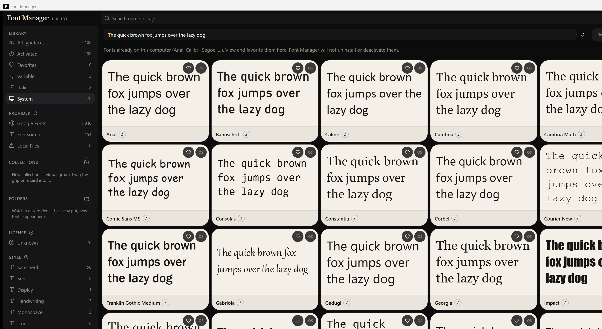

# Font Manager **1.0.133**

FontBase-style desktop typeface library for Windows. Browse **Google Fonts** and **Fontsource**, upload TTF/OTF/WOFF/WOFF2/TTC, then **Activate** so Word, Adobe, and Figma see them while this window is open.

**100% temporary session activation.** Zero registry bloat. Fonts unload on close. Files live in `Documents / Font Manager` — nothing is copied to `C:\Windows\Fonts`.

---

## Screenshots

| Library (desktop) | System fonts on this PC |
| --- | --- |
|  |  |

Captures are from the **installed desktop app** so specimens actually paint (OS faces + catalog CSS). The website preview cannot register fonts for Word.

---

## Features

| Area | What it does |
| --- | --- |
| **Library** | Search, sort, grid/list. ~2,100 faces. Virtual-scrolled cards with live specimens. |
| **Activate** | Session fonts via `AddFontResourceExW`. Other apps see them until you Deactivate or quit. |
| **Google Fonts** | Official list (~1,946). Overflow: Activate remaining / Deactivate all / Scan disk. |
| **Fontsource** | Exclusive `type: other` families (~150). Same overflow menu. |
| **Uploads** | Drop files or a folder. Stay in Documents. Deactivate unloads; Delete removes files. |
| **System** | View-only snapshot of fonts already on the PC. Never uninstalls OS faces. |
| **Inspector** | Weight, italic, variable axes, OpenType toggles, license. |
| **Playground** | Compare activated faces side by side. |
| **Glyphs** | Character map by Unicode block. Search by char, hex, or name. |
| **Duplicates** | Same-size binary diff; auto-hide extras. |

---

## Activate vs Deactivate vs Delete

| | Disk | Other apps |
| --- | --- | --- |
| **Activate** | Download if missing; keep the TTF | Register for this session |
| **Deactivate** | File stays | Unload |
| **Delete** | Remove the family folder | Unload |

**X** quits the app (session fonts unload). Families already saved in Documents are registered again on next launch — no re-download.

---

## Install (Windows)

1. [Node.js 22 LTS](https://nodejs.org) (Node 24 also builds).
2. Clone or unzip → open the **inner** project folder in VS Code (not an empty wrapper). A name like `font-manager-main (1)` is fine.
3. Double-click **`deploy.bat`** and leave it open through all three phases: pack UI → compile Rust (first time 5–15 min) → write installers.
4. Install from `src-tauri\target\release\bundle\nsis\` (or `bundle\msi\` if WiX built one).
5. If an older setup fights the new one: run **`fix-install.bat`**.

**`desktop-setup.bat`** only runs the app in a dev window — it does **not** make installers.

NSIS always builds. MSI needs [WiX Toolset v3](https://wixtoolset.org). WebView2 is embedded if missing.

---

## Website vs desktop

| | This website | Desktop window |
| --- | --- | --- |
| Library cards | Google CSS2 / Fontsource CSS | **Same** preview pipeline |
| Activate | Preview only (no GDI) | Registers so Word/Adobe see the TTF |
| System drawer | Empty | Lists fonts already on the PC |

---

## Stack

- **UI:** Vite, React, Zustand
- **Desktop:** Tauri 2 + Rust (`AddFontResourceExW` / `RemoveFontResourceExW`, session paths under Documents)
- **Preview:** Chromium `FontFace` + Google CSS2 / Fontsource CSS

---

## Troubleshooting

| Symptom | Fix |
| --- | --- |
| First Activate is slow | That family is downloading. Next launch only registers the on-disk file. |
| Word doesn’t list the face yet | Wait a second; reopen the font menu. |
| Setup skips install/uninstall radios | Use the **1.0.133** setup. Radios appear when an old copy is installed. |
| Unable to uninstall / Error launching installer | Run **`fix-install.bat`**. Right-click setup → Properties → **Unblock** if needed. |
| Build window closed after `index.html` | That was only the UI pack. Re-run `deploy.bat` and wait for Explorer. |

---

## License

See [LICENSE](LICENSE).
