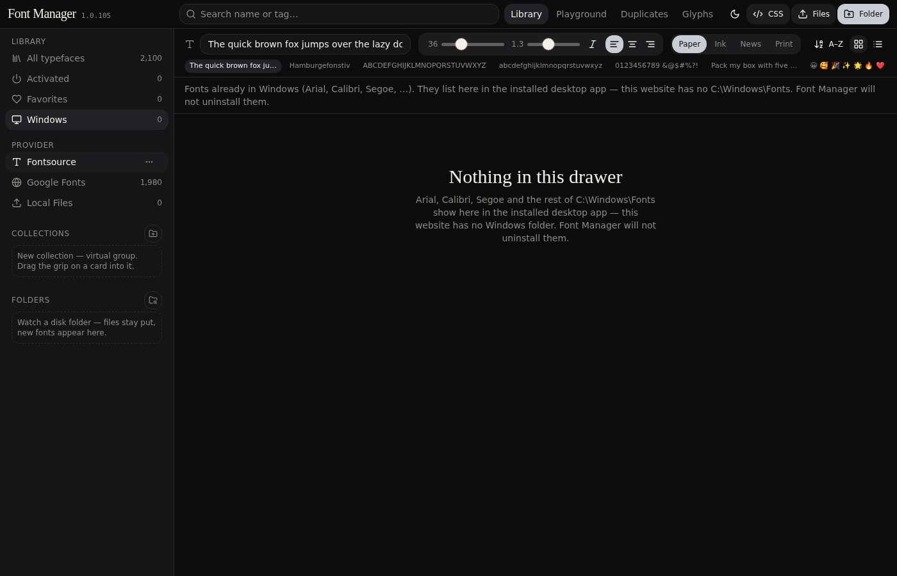

# Font Manager **1.0.128**

**TL;DR.** FontBase-style desktop typeface library. Browse Fontsource and Google Fonts, upload TTF/OTF/WOFF/WOFF2/TTC, **Activate** so Word, Adobe, and Figma can use them while this window is open. **100% temporary session activation. Zero registry bloat. Fonts unload on close.** Files live in `Documents / Font Manager`. Nothing is copied to `C:\Windows\Fonts`. This website is the same UI — a dress rehearsal before `deploy.bat`.

Version **1.0.128** sits next to the logo, not in the window title.

**1.0.128** — Google drawer is the official fonts.google.com list (**1,946**), not Fontsource `type: "google"` (**1,980**). Extra Fontsource rows stay in Fontsource. Refresh fetches both catalogs and classifies by intersection. Preview still falls back to Fontsource CSS if Google has no TTF.

**1.0.127** — Boot loads the live Fontsource cache before restoring Activated, so ~2,100 catalog faces are not clipped to the bundled **2,062**. Watch folders have no file-count cap (still refuse Windows\\Fonts and Documents\\Font Manager).

**1.0.126** — Watch folder lists + fingerprints (`mtime`/`size`) instead of re-reading every TTF on a 2.5s timer. Native `watch` when the installer has it; otherwise an 8s poll. Refuses `C:\\Windows\\Fonts` and `Documents\\Font Manager`. First tick waits until boot is done.

**1.0.125** — System is **view-only** (Library, Playground, Glyphs, Duplicates). Never `Add`/`Remove` `C:\\Windows\\Fonts`. Deactivate no longer walks every family folder (that freeze). Progress bar hidden when the queue is empty — no more “Registering 0 already on disk.”

**1.0.124** — System names are OpenType **name ID 16/1** (Fonts CPL), not `arial.ttf`. Cards do not inject FontFace from `C:\\Windows\\Fonts` (that hid the real OS specimen). System ··· / inspector **Open Fonts folder**. Watched local files preview from their disk path.

**1.0.123** — System drawer is a **one-time snapshot of `C:\Windows\Fonts`**, not GDI `EnumFontFamilies`. Session fonts (flag 0) were showing up as System and the list jumped on every `WM_FONTCHANGE`. Activate never `Add`s files from Windows\Fonts. Bulk download broadcasts **once** at the end, not every family. Quit still hides, `Remove`s session paths (flag 0), one flush, one broadcast. Crash recovery still uses `.session-paths.txt`.

**1.0.122** — Windows build: dropped unused `DiskIndex.corrupt`, `index_has`, and `family_on_disk` (left over after targeted Activate).

**1.0.121** — Startup, Activate, and Quit no longer freeze the window. Boot registers only the families from last session (full-folder scan runs after). Activate / Deactivate return immediately; GDI Add/Remove run on a worker. One `WM_FONTCHANGE` at the end of a batch, not per file. Quit flushes GDI once. Full TTF/OTF files — no subsetting.

**1.0.120** — License, Style, and Tags work on **All typefaces** (and every other drawer), not only Activated / Favorites.

**1.0.119** — Specimen first. Toolbar is sample, size, italic, theme; line-height / align / sort sit in **···**. Cards show the name, not “1 wts · SANS · OPEN”. If you already had faces on, launch opens **Activated**. This website cannot register fonts for Word — the Activate control says so. Quit unload and disk-vs-catalog scan were already the 1.0 gate.

**1.0.118** — Drawer label is **System**. Static catalog families were locked italic because `italic: true` means “has an italic cut”, not “this file is italic-only”. Header and card I now toggle roman/italic on non-variable faces; only uploaded `*Italic.ttf` files stay locked.

**1.0.117** — **System fonts** drawer is back (always listed; this website stays at 0). Playground / Glyphs pickers list them first. Duplicates keep **system > Fontsource / Google Fonts > uploads**. Header italic actually slants catalog cards (snapshot VF has no fvar; synthesis is the preview until the italic face loads). Grid specimen pane uses `flex: 1 1 auto` again so fit-to-size does not collapse. OS/2 still supplies weight, italic bit, and PANOSE — it is not a license database.

**1.0.116** — Windows drawer is hidden on this website (no OS folder here). Quit **joins** the unload thread; 45s is only the hung-GDI cap. PANOSE from the OS/2 table already tags uploads — dummy Dafont templates are ignored; file name still wins. Dead disk-list helpers removed.

**1.0.115** — Unload no longer walks every Documents folder (that was thousands of no-op `Remove`s plus Defender on Quit). Paths this process added are snapshotted to `.session-paths.txt`; Quit gates `Add` off, waits in-flight GDI, Removes those paths in chunks of 64 with a local `GdiFlush`, then one `WM_FONTCHANGE`. A killed quit is healed on the next launch from that list, before any file delete. `AddFontResourceExW` is a session font-table entry, not an `HFONT` — the 10k GDI-handle quota is pens/DCs/fonts created in-process; broadcasting font-change after every file is what blows Explorer/Word.

**1.0.114** — X / Quit hides the window, then **finishes** `RemoveFontResourceExW` (flag 0, same as Add) for every session file **and** leftover TTF under Documents. Enumerable GDI fonts do not vanish when the process dies — a short watchdog was killing unload at 8s and leaving ~2,000 faces in Word/Adobe. Watchdog is 45s and only if unload never returns. Active paths live in a Rust `HashSet` (`loaded`) plus `.session-active.json` family names. Documents folder count is not the catalog: renamed/delisted leftovers are removed on launch (uploads + current catalog + this session are kept). The app never writes to `Windows\Fonts` or the registry.

**1.0.113** — Activate no longer pretends to download while it checks Documents. Progress is **Scanning** → **Registering** (intact files) → **Downloading** (missing only, 3 at a time). Intact lookup is per-family paths, not a walk of 2,000 folders. Injected preview CSS uses `font-display: swap` so cards do not flash blank. Glyphs/Playground read Windows fonts from their OS path. Duplicates stay catalog vs uploads — not Windows.

**1.0.112** — Documents is **not** the catalog. The library is ~2,100 names (Google Fonts + Fontsource). Explorer’s item count is every family you ever Activated (Deactivate keeps files) plus `.session-active.json`. Scan disk now reports disk vs catalog and can remove folders that are not in the catalog or uploads. Boot walks Documents **once** (junk + empty + index) instead of three to five times; Activate All no longer re-sweeps 2,000 folders first.

**1.0.111** — On launch, **before** any `AddFontResourceExW`, Rust drops truncated/non-SFNT files, then wipes family folders that have **no intact TTF/OTF/TTC** (empty, sidecar-only, aborted). A missing sidecar on an intact file is still not a wipe. Scan disk stays read-only. The 2,100-family catalog does **not** cross Tauri IPC — it is the shipped snapshot plus IndexedDB; Rust only gets family names and file paths. Search typing stays live; the grid and sidebar counts use a deferred query so the virtual list does not recompute on every key.

**1.0.110** — Scan disk is **read-only** (integrity counts). Delete is a separate pass: startup, before any `AddFontResourceExW`, drops only files that fail the TTF header check. A missing `.fontsource-version` sidecar is **not** a wipe (uploads and last-session files have none). Retry still unregisters, local `GdiFlush`, then file-by-file delete. We do **not** touch `FNTCACHE.DAT` or the Font Cache service.

**1.0.109** — Retry / Delete / overwrite **unregisters first** (`RemoveFontResourceExW` even if this process did not Add, then a local `GdiFlush`, then delete with a short lock retry). A locked face returns “close Word or Adobe, then Retry” — the worker does **not** skip the download. File-by-file, not `remove_dir_all`. Activate still skips intact files. Catalog Refresh still does **not** download or wipe TTF.

**1.0.108** — Catalogs boot from the shipped Fontsource / Google snapshot (instant). The **Provider** header has a refresh control: one Fontsource API fetch, split by `type` into Fontsource vs Google Fonts. The live list is cached in IndexedDB so the next launch still starts instantly. A quiet check runs once a day after idle and toasts only when families were added. This is not a boot-blocking fetch, not a Rust `catalog.json` write, and not an auto-update of TTF files.

**1.0.107** — Library preview stays CSS (Google CSS2 / Fontsource `index.css` on jsDelivr) for visible cards. Activate still does **not** fetch TTF until you click it: Rust scans Documents, registers intact files, and only then downloads Fontsource TTF (API version pinned on jsDelivr, latin 400/700, max 4 files) in a **3-worker** background queue. Activate again is register-only — a newer Fontsource release is **not** pulled until you Retry. HTTP stays 4s connect / 10s total (5s drops large families). Session activation: enumerable `AddFontResourceExW`, files only in `Documents / Font Manager`, no registry, matching `RemoveFontResourceExW` on X. Failed downloads stay pending with Retry (the toggle is not silently flipped off).

**1.0.106** — Activate is still a session register (`AddFontResourceExW` with enumerable flags, files only in `Documents / Font Manager`, no `C:\\Windows\\Fonts` copy, no registry). X waits for matching `RemoveFontResourceExW` (same flags) then one `WM_FONTCHANGE` without `GdiFlush`, then exits. An 800ms watchdog was killing the process mid-unload and leaving faces registered; it is now 8s. Launch heals a crash leftover (Remove then Add once per path). The unused `unload_all` warning is gone. Local cards paint the file’s weight and italic (Name ID 4 truncated on the card). Playground / Glyphs can pick Windows fonts (already on the machine). Duplicates still ignores OS fonts. This website’s Windows drawer stays at 0.

**1.0.105** — X / Quit hides the window immediately, unloads session fonts without broadcasting `WM_FONTCHANGE`, then kills the process (Tauri `exit` from a worker used to deadlock with the close handler). The Windows drawer lists installed families through GDI (`EnumFontFamiliesExW` — Arial, Calibri, Segoe, …) instead of walking `C:\Windows\Fonts` file-by-file. `list_system_fonts` is allowed in the desktop capability. Desktop detection does not cache a false “website” state, so the empty copy no longer claims “this website has no Windows folder” inside the installed app. This website still shows **0** — there is no Windows folder here.

**1.0.104** — Card weight slider keeps its fitted size while you drag (heavier no longer jumps the point size). Variable CSS no longer pins Regular via `font-named-instance`, and Fontsource VF family names (`InterVariable`) are rewritten to the card’s family so `font-weight` actually interpolates. Inspector axes follow the same live store as the card (weight no longer snaps back to Regular). License / Style / Tags recount when you change drawer (Fontsource, Activated, …) instead of keeping All’s Sans/Open facet. Catalog refresh no longer relabels Fontsource as Google Fonts when `type` is missing — Activate notes stay on the right host. First Activate on this website no longer waits on a desktop import.

**1.0.103** — Card weight slider paints CSS immediately and does not persist on every pixel (axes flush after 400ms / when the tab hides). Activate / Deactivate updates the store first so the grid does not wait on storage APIs; this website no longer kicks off extra font downloads on Activate. Toasts name the right host: Fontsource → jsDelivr, Google Fonts → Google. License / Style / Tags counts follow the current drawer **and** the active facet (Fontsource + Sans → Open is the sans count, not the whole provider). Pending activations count as on so the Activated drawer updates before the desktop download finishes.

**1.0.102** — Duplicate license/style/tag chips above the grid are gone. Variable / Italic live in the sidebar (counted inside the current drawer); the row above the grid is only **active** filters. License / Style / Tags count and filter inside the current drawer (Activated → those counts, not the whole catalog). Weight slider paints `font-weight` + `font-variation-settings` on the specimen immediately (fit-to-size no longer re-runs on every tick). Persist writes are debounced so dragging an axis does not hammer storage. The grid already virtual-scrolls — Windows 0 on this website is correct (no `C:\\Windows\\Fonts` here).

**1.0.101** — Fontsource and Google Fonts are **disjoint providers**. Fontsource is `type: other` (~120 families). Google Fonts is Google-origin. Activate remaining / Deactivate all on one cannot turn the other on. They are not two copies of Inter, so Duplicates does not list them as a pair. License / style / tags use one vocabulary (Open/Freeware/Personal/Commercial/Unknown, the seven style categories, TAG_ORDER plus symbols). Unlicense maps to Open.

**1.0.100** — Google Fonts row has the same Activate remaining / Deactivate all / Scan disk menu as Fontsource. One family name is one registration: activating a catalog face unloads a local of that name, and the other way around.

**1.0.99** — Variable roman stays roman (Source Sans 3 and other `ital`/`slnt` faces). Google Fonts CSS2 is the library preview again (`fonts.googleapis.com` / `fonts.gstatic.com` preconnect). Sidebar providers: **Fontsource → Google Fonts → Local Files**. Duplicates page can auto-hide extras (keeps the catalog family, deactivates the upload). Glyphs groups use official Unicode blocks and names Latin / Greek / Cyrillic / punctuation when the file has no PostScript name.

**1.0.98** — Header chips match the sidebar: only licenses, styles, and tags that have fonts. Personal stays hidden until you have personal-use files. Variable / Italic still appear when the catalog has them.

**1.0.97** — Fontsource CSS preview, 7 style categories. **1.0.96** — Fontsource provider. **1.0.95** — fallback cap.

**1.0.90** — Scan before download flag. **1.0.89** — session restore + slider persist. **1.0.88** — card/inspector axes share a store. **1.0.86** — Fontsource TTF for WOFF2-only families. **1.0.85** — Deactivate keeps files.

**1.0.88** — Library card weight slider and inspector axes share one store. Drag either; both update. Google CSS preview is never `&text=`-subsetted. Activated files on disk stay the install cache (Word/Adobe); the grid still paints through CSS so this website and the desktop window match.

**1.0.87** — Windows build compiles (borrow checker). **1.0.86** — WOFF2-only families install via Fontsource TTF. **1.0.85** — Deactivate keeps files; Activate again does not re-download.

**1.0.85** — Deactivate keeps files. Activate again only registers them. Download runs only when the family is missing or the files are broken (WOFF2/truncated).

**1.0.84** — Activate installs every Windows-installable style (weights + italic). WOFF2 is skipped. Three workers.

**1.0.83** — Playground themed scrollbar. **1.0.82** — Library CSS preview matches desktop. **1.0.81** — launch does not download. **X closes the app**; on-disk activations come back next launch.

---

## Features

| Area | What it does |
| --- | --- |
| Library | Search, sort, grid/list. Variable / Italic in the sidebar; active-filter chips above the grid. Cards virtual-scroll (~280px columns). No “Show more” button. |
| Activate | Session fonts via `AddFontResourceExW`. Other apps see them until you Deactivate. Close quits. Next launch re-registers **files already in Documents** — it does not download. |
| Fontsource | Fontsource-exclusive families (`type: other`, ~120). Overflow menu: Activate remaining / Deactivate all / Scan disk. Does **not** include Inter, Roboto, or other Google-hosted faces. Preview tries Google CSS2 first, then Fontsource CSS. Activate scans Documents first; download Fontsource TTF if missing. |
| Google Fonts | Google-origin families (`type: google`). Same overflow menu. Activate remaining here cannot queue Fontsource-only faces, and the other way around. Activate still scans Documents, then Fontsource TTF, then Google CSS TTF. |
| Uploads | Drop files or a folder (TTF, OTF, WOFF, WOFF2, TTC). Parsed on a worker so the grid stays live. Stay in Documents. Deactivate unloads; Delete removes files. |
| Inspector | In-flow right column (not a dimmed overlay). Weight, italic, variable axes, OpenType toggles, license. |
| OpenType | GSUB/GPOS tags from the TTF. Toggles drive `font-variant-*` + `font-feature-settings`. Demo line: `Office fi fl 1/2 0123`. |
| Playground | Compare activated faces. |
| Duplicates | Same size → binary diff. Catalog vs upload of the same family is listed. **Auto-hide** keeps the catalog family. Activate never registers both a catalog face and a local of that name. Fontsource / Google Fonts do **not** appear as a pair — they do not share families. |
| Glyphs | Character map grouped by Unicode block. Search by character, hex, or name (Latin / Greek / Cyrillic / punctuation, plus the file’s glyph names). Tofu stays (hover **?**). Atlas is cached — first open of a face is the slow parse; switching tabs does not reload. |
| Windows | Desktop app lists families GDI already has (Arial, Calibri, Segoe, …). View and favorite only — Font Manager will not uninstall them. This website has none. |
| Collections / Folders | Virtual groups vs watched folders on disk. |
| License / Style / Tags | Counted inside the current drawer (All, Activated, Fontsource, …). Clicking Sans Serif while on Activated lists activated sans, not the whole catalog. One vocabulary: Open / Freeware / Personal / Commercial / Unknown; seven style categories; TAG_ORDER tags. Dummy PANOSE from free-font sites is ignored. |

---

## Screenshots

| | |
| --- | --- |
| Library |  |
| Windows (this website) |  |
| Playground |  |
| Glyphs |  |
| Duplicates |  |
| Inspector |  |

---

## Activate vs Deactivate vs Delete

| | Disk | Other apps |
| --- | --- | --- |
| **Activate** | Download if missing; keep the TTF | Register for this session |
| **Deactivate** | File stays | Unload |
| **Delete** | Remove the family folder | Unload |

**X** closes the app. Families already saved in Documents are registered again. Google files are **not** downloaded until you Activate.

---

## Install (Windows, VS Code only)

1. [Node.js 22 LTS](https://nodejs.org) (Node 24 also builds).
2. Unzip the project → VS Code **File → Open Folder**.
3. Double-click **`deploy.bat`**. Leave it open through **three** phases:
   1. **Pack the UI** — Vite writes `desktop-….js`. A banner says **Phase 1 done**. That is **not** the installer.
   2. **Compile Rust** — cargo `--release` with LTO (first time 5–15 minutes). Looks like a new process; do not close the window.
   3. **Write installers** — MSI (if WiX v3 is installed) and NSIS setup. Explorer opens `src-tauri\target\release\bundle\`.
4. Install from `bundle\nsis\` (or `bundle\msi\` if WiX built one). Other PCs do not need Node or Rust.
5. If an older setup is still on the PC: double-click **`fix-install.bat`** (clears leftover AppData + registry, then launches the new setup). Fonts in `Documents / Font Manager` stay.

**`desktop-setup.bat`** only **runs** the app (dev window). It does **not** make installers.

NSIS always builds. MSI needs [WiX Toolset v3](https://wixtoolset.org); without it you still get the NSIS setup. If WiX is installed but not on PATH, setup now adds its `bin` folder automatically. No Visual Studio IDE. WebView2 is embedded if missing.

**X** closes the app. On-disk activations come back on the next launch. Google downloads only happen when you click Activate.

### What the yellow compile log meant

| Line | Meaning |
| --- | --- |
| `INEFFECTIVE_DYNAMIC_IMPORT` | Harmless cycle-breaking `import()`. Filtered as of **1.0.81**. |
| `PLUGIN_TIMINGS` | Vite timing info. Filtered. |
| `[tauri-index] wrote …\index.html` | UI pack finished. Quiet now. **Rust had not started yet.** |
| `DATABASE_URL not set` | Website migrate skip. Desktop never runs it. |
| Tab title `db:migrate` | Nested npm script. Desktop uses a dedicated hook so the tab stays on `tauri build`. |

Closing the window after `index.html` aborts cargo. Wait for Explorer to open `bundle\`.

---

## How this was prompted (vibe coding)

You never opened an IDE first. You talked to **Grok Build**, watched the live preview, sent screenshots, and said what was wrong.

**Opening line (paraphrase).** *Clone FontBase: a Documents folder of real fonts, activate so other programs see them, Google auto-download, uploads.*

**How to prompt this kind of app**

1. Name the clone and the **one folder** on disk (`Documents / Font Manager`).
2. Spell rules as tables (Activate vs Deactivate vs Delete).
3. When a control is slow or lies, say **which screen** and **desktop vs website**.
4. Send a screenshot. Ask **not** to touch unrelated code.
5. When the Grok preview looks right, run `deploy.bat`. Desktop-only bugs (GDI, tray, downloads) only show after that.

**Preparations:** Grok App Builder (Vite, React, Playwright, Tauri 2), Node.js **22+**, Rust stable, Google Fonts metadata + Fontsource CDN. No foundry files in the installer. Then **VS Code** + `deploy.bat`.

---

## Stack (what actually runs)

- **UI:** Vite, React, Zustand persist (favorites, activated, collections, tags, uploads, preview, slider axes, scope — not the download queue).
- **Desktop:** Tauri 2, Rust `reqwest` downloads, `AddFontResourceExW` + debounced `SendNotifyMessageW(WM_FONTCHANGE)`. Quit hides the window, unloads with matching `RemoveFontResourceExW`, posts one `WM_FONTCHANGE` (no `GdiFlush`), then `process::exit`. Windows drawer uses `EnumFontFamiliesExW`.
- **Parse:** Fast table reader for TTF/OTF/WOFF1/TTC (name, OS/2, fvar, GSUB tags). `opentype.js` is the fallback. Desktop also has Rust `ttf-parser` for cmap / axes on files in Documents. WOFF2 previews in the browser; Windows install still wants TTF/OTF.
- **Preview:** Chromium `FontFace` + Google CSS2 (same on this website and in the desktop WebView). Word/Adobe use DirectWrite/GDI after Activate.

Not wired in on purpose: **skrifa**, **DirectWrite in the WebView**, auto-update of the installer.

---

## Activation after close

Activate is a **session** register (`AddFontResourceExW`, enumerable flags). Files stay in `Documents / Font Manager` — never copied to `C:\Windows\Fonts`, never written to the font registry. Closing the window **quits**: hide, matching `RemoveFontResourceExW`, one `WM_FONTCHANGE`, then the process exits. Other apps drop those families. A crash leftover is healed on the next launch (Remove then Add once). **100% temporary** — zero registry bloat; session fonts unload on close.

Next launch:

1. Before any GDI Add: drop files that fail the TTF header check. Then wipe family folders with **no intact TTF/OTF/TTC** (empty, sidecar-only, aborted). Intact files stay. A missing sidecar on an intact file is not a wipe. `FNTCACHE.DAT` is not touched.
2. One walk of Documents (read-only). Intact last-session files are registered so Word/Adobe see them again. One `WM_FONTCHANGE` after the batch.
3. The UI marks those families Activate. Missing names are **not** queued.
4. Nothing is downloaded until you click Activate. If the family is already in Documents and intact, it is only registered.

Deactivate unloads and **keeps files**. Activate again does **not** download. Delete removes the folder. Scan disk can remove folders that are no longer in the catalog (uploads are kept).

---

## Google download

1. Click Activate. The UI returns immediately. A background thread scans `Documents / Font Manager`.
2. Intact TTF/OTF/TTC → register, skip fetch. Progress says **Registering**, not Downloading. The family turns on as soon as its folder is intact.
3. Missing or broken → download **up to three families at a time**. **Fontsource TTF first** (API version on jsDelivr, latin 400/700, max 4 files). Google CSS TTF only if Fontsource had nothing. A `.fontsource-version` sidecar is written; it is not used to auto-update on the next Activate.
4. **Retry** unregisters (`RemoveFontResourceExW`, even for a crash leftover), local `GdiFlush`, then deletes file-by-file (lock retry). Not `remove_dir_all`. If Word still has the file, the family fails with Retry — the queue continues.
5. HTTP: 4s connect, 10s total. `WM_FONTCHANGE` at most every 1.5s. Stop kills the queue. Deactivate unregisters from the in-memory session map and returns immediately when many families are selected.

Deactivate unloads and **keeps files**. Activate again is register-only. Preview stays CSS in this window.

Google downloads sit in `Documents / Font Manager`. They are not listed as a separate drawer — **Windows** is `C:\Windows\Fonts` (Arial, Calibri). Activate still scans Documents first.

---

## Next version (not in 1.0.102)

- Signed installer + auto-update (SmartScreen / Store) — needs a code-signing cert.
- Native WOFF2 → TTF in Rust — Fontsource TTF already covers install.
- Search chips — license/tag rows already filter.
- Extra TTC preview cards — TTC already registers every face with Windows.
- Fontshare / Bunny behind the same scan-then-download queue.

---

## Variable weight slider

Hover a variable card to pop a weight slider. That value lives in one Zustand map (`previewAxes`) shared with the inspector, so the selected card and the inspector scrub together. Specimen size is not re-fit on every tick (that used to cancel the weight change). Persist of the slider is debounced; CSS is not.

---

## Website vs desktop library

| | This website | Desktop window |
| --- | --- | --- |
| Library cards | Google CSS2 + FontFace for Google-origin; Fontsource CSS for `type: other` | **Same** |
| Activate | Preview only (no GDI) | `AddFontResourceExW` so Word/Adobe see the TTF |
| Documents folder | Not used | Scan first; skip intact; download missing on Activate |

Do not expect a second “desktop-only” preview. If a family is already in Documents, Activate still registers that file; the card still paints through CSS so it matches Grok.

---

## Catalog refresh

Boot uses the **shipped** Fontsource + Google snapshot (~2,060 families). It does not wait on the network.

The refresh control next to **Provider** fetches `https://api.fontsource.org/v1/fonts` in the browser (this website and the desktop WebView). One list, split by `type`: `other` → Fontsource drawer, `google` → Google Fonts. The merged list is cached in IndexedDB. Next launch reads that cache locally.

A quiet check runs once a day after the window is idle and only toasts when families were added. Refresh does **not** re-download or wipe TTF files. Retry is the TTF replace. Activate is still scan-then-download.

Not a Tauri `catalog.json` in AppData — the website cannot invoke Rust, and the Fontsource API already allows this fetch. `path_resolver()` is Tauri 1.

---

## Pseudo-subsetting — yes, for this website only

Library preview uses **Google CSS2** first (roman-only `ital,wght@0,…` so variable italic stays off), then Fontsource CSS on jsDelivr (`wght.css` / `index.css`). It is **not** used for desktop TTF installs. Word and Adobe need the real file.

| | Website preview | Desktop Activate |
| --- | --- | --- |
| Technique | CSS `&text=` alphabet | Full TTF from Fontsource / Google |
| Why | Faster first paint | Other apps cannot use a 52-letter subset |

---

## Store-ready (Windows)

The MSI + NSIS installers are what you ship today: no telemetry, local files only, publisher/copyright/license on the bundle, activations survive Quit. NSIS installs for the **current user** (no admin). WebView2 bootstrapper is embedded.

Microsoft Store still needs an **MSIX**, a paid publisher identity, and code signing. Those are not produced here. Sideload the MSI or NSIS setup for personal use.

---

## GitHub

The connected GitHub account (`eect13`) cannot create repositories from this chat (the connector is missing `repo` create). Create **`eect13/font-manager`** (private is fine) in the GitHub UI, then reconnect GitHub with repository write access and ask to push. `.gitignore` excludes `node_modules`, `src-tauri/target`, installers, and `.vercel`.

---

## Library windowing

A sentinel with an 800px margin used to append cards until **all ~1,942** were in the DOM.

Now: the grid **virtual-scrolls**. Only the rows in view (plus a small overscan) are in the DOM, so all ~1,968 families stay scrollable without a “Show more” button.

Library / Playground / Duplicates / Glyphs stay **mounted** after the first visit (`visibility` hide, not `display: none`) so search, scroll, and the glyphs atlas survive like browser tabs. Visited tabs are remembered in `sessionStorage` for this window.

**Glyphs:** tofu boxes stay — they are cmap slots with no drawable outline, and they count. Hover the **?** next to the glyph count. First parse of a face is the slow part; the atlas is cached and tab switches do not re-parse.

---

## OpenType features

Toggles looked dead because “The quick brown fox” has no `fi` / `1/2`, and Google faces were not parsed for GSUB.

Opening the inspector reads GSUB/GPOS from the TTF. Switches set `font-variant-ligatures` / `caps` / `numeric` plus `font-feature-settings`. Watch **`Office fi fl 1/2 0123`**. Coding faces (Anonymous Pro) often have no `liga` — after parse, only real tags stay.

---

## Troubleshooting

| Symptom | What to do |
| --- | --- |
| First Activate is slow | That family is downloading. Next launch registers the file on disk — no fetch. |
| `tauri.conf.json` parse error | Version must be `"1.0.102",` — **one** comma. |
| Word doesn’t list the face yet | Wait a second; open the font menu again. |
| OT toggles do nothing | Use the demo line, not the pangram. Confirm the file actually has that tag. |
| Display face clipped | Library cards shrink-to-fit (min 13px). Inspector alphabet wraps with `overflow-wrap: anywhere`. |
| Can’t install — **Unable to uninstall** / **Error launching installer** | Double-click **`fix-install.bat`**. Rebuild with **1.0.102** (`deploy.bat`). Right-click setup → Properties → **Unblock** if Windows marked the file. |
| Build window closed after `index.html` | That was only the UI pack. Re-run `deploy.bat` and wait for Explorer. |
| MSI missing, only setup.exe | Install [WiX Toolset v3](https://wixtoolset.org), then `deploy.bat` again. NSIS is enough to install. |

**1.0.81 — ready for personal desktop use.** License / style / tags stay inferred. Not legal advice.
